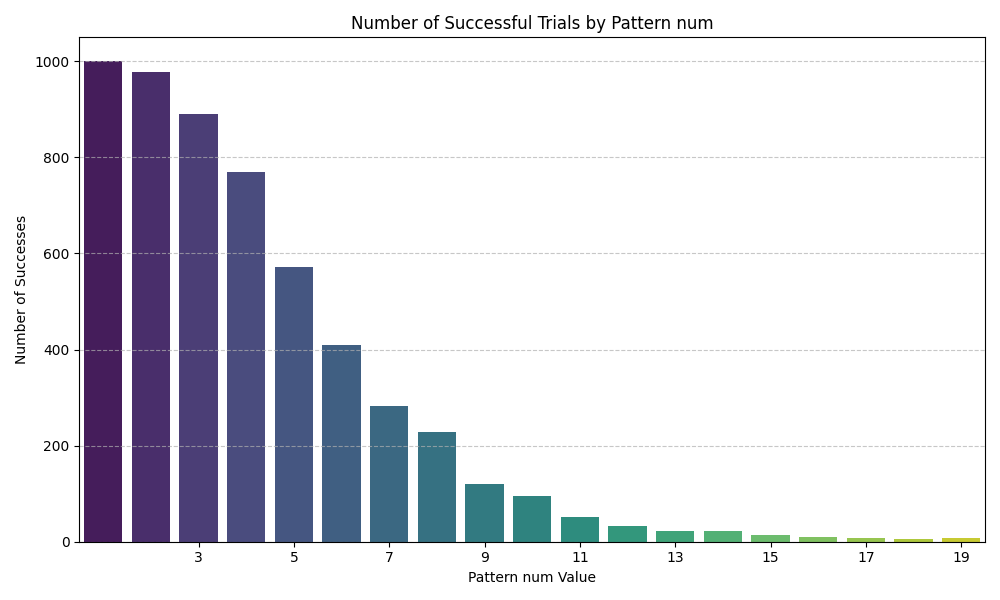
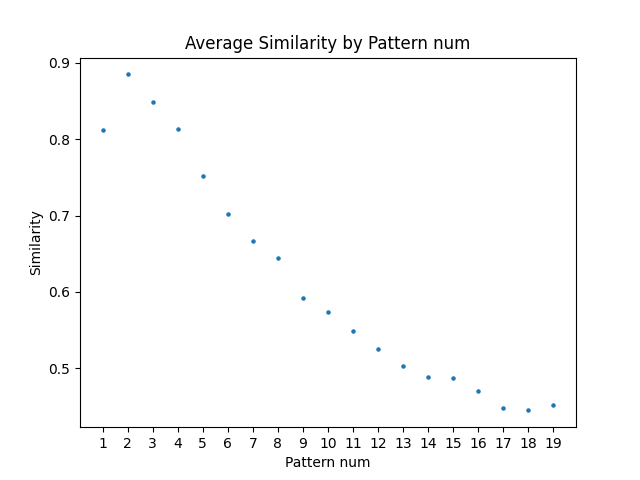
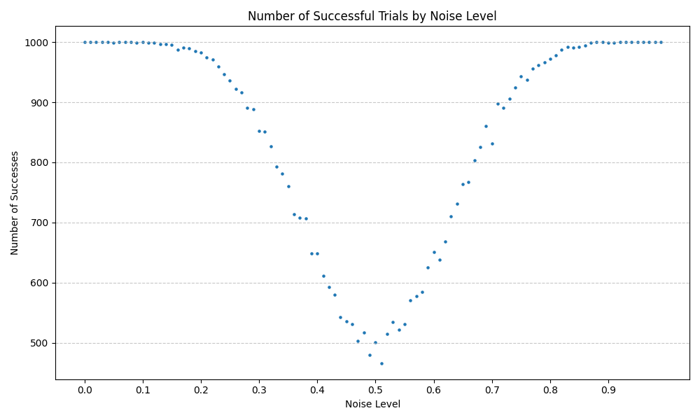
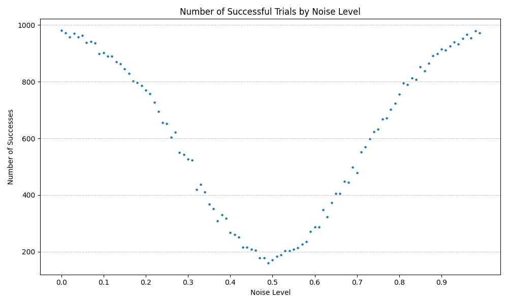
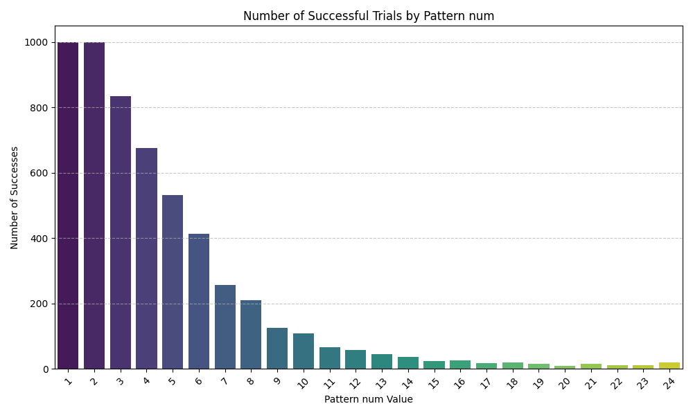
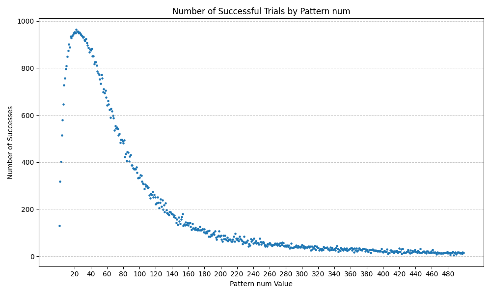
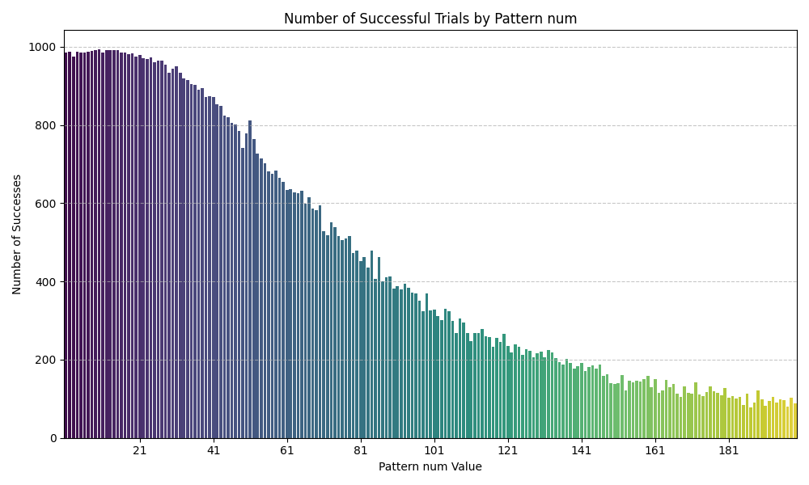
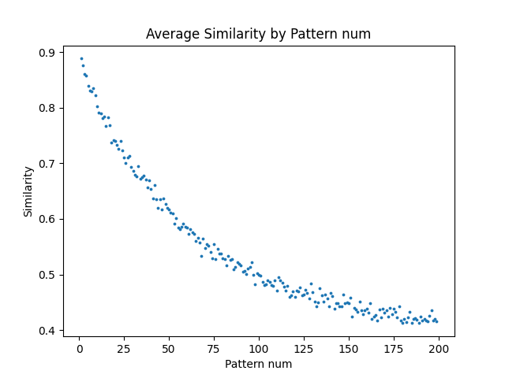
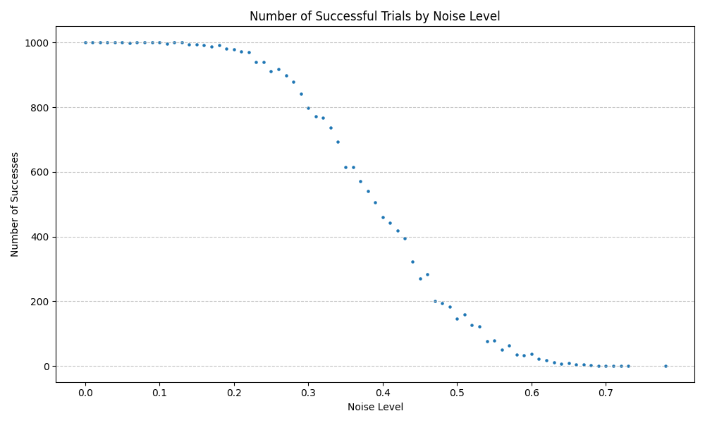
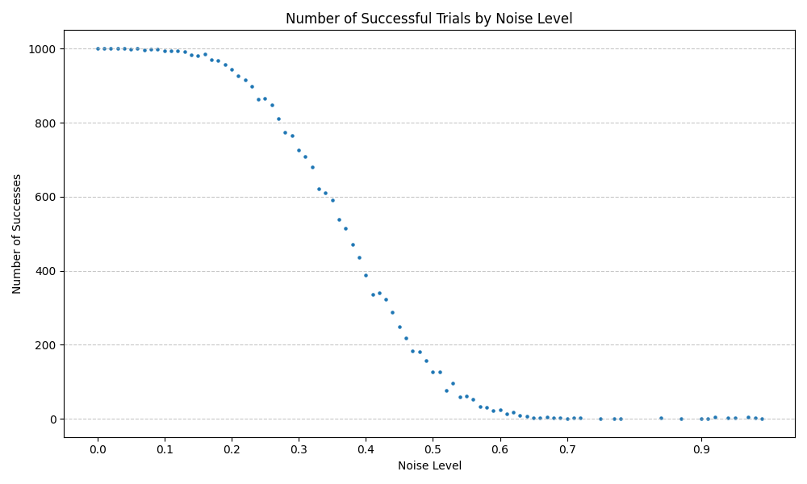

# 知能機械情報学　前半レポート
##### 03240278 橘嵩時

C++を用いてHopfield Networkを作成した。以下がそのコードである。
```cpp
//pattern.hpp
#pragma once

#include <vector>
#include <algorithm>
#include <cstdint>
#include <cstdlib>
#include <random>
#include <chrono>
#include <stdexcept>


class Pattern {
public:
    Pattern(int size) : N(size) {
        data.resize(N);
        std::random_device rd;
        std::mt19937 gen(rd());
        std::uniform_int_distribution<> dis(0, 1);
        for (int i = 0; i < N; ++i) {
            data[i] = (dis(gen) == 0) ? -1 : 1;
        }
    }

    Pattern(std::vector<int8_t> input_data) : data(input_data), N(input_data.size()) {
        if (data.size() != N) {
            throw std::invalid_argument("Input data size does not match the specified size.");
        }
    }

    double similarity(const Pattern& other) const {
        if (N != other.N) {
            throw std::invalid_argument("Patterns must have the same size for similarity calculation.");
        }
        int dot_product = 0;
        for (int i = 0; i < N; ++i) {
            dot_product += data[i] * other.data[i];
        }
        return static_cast<double>(dot_product) / N;
    }

    std::vector<int8_t> data;
    int N;
};

#include <iostream>

std::ostream& operator<<(std::ostream& os, const Pattern& pattern) {
    for (int i = 0; i < pattern.N; ++i) {
        if (pattern.data[i] == 1) {
            os << "■ ";
        } else {
            os << "□ ";
        }
        if ((i + 1) % 25 == 0) { // 改行
            os << std::endl;
        }
    }
    return os;
}

inline Pattern addNoise(const Pattern& pattern, double noise_level) {
    std::vector<int8_t> noisy_data = pattern.data;
    std::random_device rd;
    std::mt19937 gen(rd());
    std::uniform_real_distribution<> dis(0.0, 1.0);

    for (int i = 0; i < pattern.N; ++i) {
        
        if (dis(gen) < noise_level) {
            noisy_data[i] *= -1;
        }
    }
    return Pattern(noisy_data);
}
```
```cpp
//hopfield.hpp
#pragma once 

#include "pattern.hpp"


class Hopfield {
public:
    Hopfield(int size) : newrons{Pattern(size)}, N(size) {
        if (size <= 0) {
            throw std::invalid_argument("Size must be a positive integer.");
        }
        weights.resize(size, std::vector<int>(size, 0));
    }

    void train(const Pattern& pattern) {
        for (int i = 0; i < N; ++i) {
            for (int j = 0; j < N; ++j) {
                if (i != j) {
                    weights[i][j] += pattern.data[i] * pattern.data[j];
                }
            }
        }
    }

    void recall(const int idx){
        int sum = 0;
        for (int i = 0; i < N; ++i) {
            if (i != idx) {
                sum += weights[idx][i] * newrons.data[i];
            }
        }
        if (sum == 0) {
            return;
        }else if (sum < 0) {
            newrons.data[idx] = -1;
        } else {
            newrons.data[idx] = 1;
        }
    }

    int energy() const {
        int energy = 0;
        for (int i = 0; i < N; ++i) {
            for (int j = 0; j < N; ++j) {
                if (i != j) {
                    energy -= weights[i][j] * newrons.data[i] * newrons.data[j] / 2.0;
                }
            }
        }
        return energy;
    }

    void initNewrons(Pattern& pattern) {
        for (int i = 0; i < N; ++i) {
            newrons.data[i] = pattern.data[i];
        }
    }

    Pattern newrons;
    std::vector<std::vector<int>> weights;
    int N;
};
```
```cpp
//main.cpp
#include "pattern.hpp"
#include "hopfield.hpp"
#include "hopfield_3d.hpp"

#include <iostream>
#include <fstream>


void run(int N, int PATTERN_NUM, double noise_rate = 0.5) {
    std::vector<Pattern> patterns;
    for (int i = 0; i < PATTERN_NUM; ++i) {
        patterns.push_back(Pattern(N));
        // std::cout << "Pattern " << i << ": " << patterns[i] << std::endl;
    }

    Hopfield hopfield(N);
    auto init = addNoise(patterns[0], noise_rate);
    // std::cout << "Initial noisy pattern: " << init << std::endl;
    hopfield.initNewrons(init);
    for (const auto& pattern : patterns) {
        hopfield.train(pattern);
    }

    int current_energy = 0;
    int stop_count = 0;
    double mean_similarity = 0.0;
    int i = 0;
    while (true) {
        hopfield.recall(i % N);
        int prev_energy = current_energy;
        current_energy = hopfield.energy();

        // 収束判定
        if (current_energy == prev_energy) {
            stop_count++;
        } else {
            stop_count = 0;
        }
        if (stop_count > N) {
            break;
        }
        mean_similarity += hopfield.newrons.similarity(patterns[0]);
        i++;
        // std::cout << "Energy: " << current_energy << std::endl;
        // std::cout << hopfield.newrons << std::endl;

    }
    mean_similarity /= i;

    bool success = false;
    // for (const auto& pattern : patterns) {
    //     double sim = hopfield.newrons.similarity(pattern);
    //     // std::cout << "Similarity: " << sim << std::endl;
    //     if (sim == 1.0 || sim == -1.0) {
    //         success = true;
    //     }
    // }
    if (hopfield.newrons.similarity(patterns[0]) == 1.0 || hopfield.newrons.similarity(patterns[0]) == -1.0) {
        success = true;
    }

    std::string filename = "log.csv";
    std::ofstream ofs(filename, std::ios::app);
    if (!ofs) {
        std::cerr << "Error opening file: " << filename << std::endl;
    }
    ofs << N << "," << PATTERN_NUM << "," << (success ? 1 : 0) << "," << mean_similarity << "," << noise_rate << "\n";
    ofs.close();
}

int main(int argc, char* argv[]){
    int N = std::atoi(argv[1]);
    int PATTERN_NUM = std::atoi(argv[2]);
    int TEST_NUM = std::atoi(argv[3]);
    double noise_rate = std::atof(argv[4]);
    for (int i = 0; i < TEST_NUM; ++i) {
        run(N, PATTERN_NUM, noise_rate);
    }
}
```
## 実験１
パターンを記憶させ、想起性能を調べた。ノイズはすべて20%
* 【画像１】横軸が記憶させた画像数、縦軸が正答率

  * パターン数が１であれば完全に想起できる確率が100%だが、そのあとはパターン数が増えるにつれ正答率も下がっていく。

* 【画像２】横軸が記憶させた画像数、縦軸が正解との類似度（全試行に渡る平均）

ほぼ実験1-1と同じ結果になったが、パターン数が１のときだけ少し下がった。パターン数が1だと想起が完了するまでに多くのイテレーションが必要であることがわかる。

## 実験2
ノイズと想起性能の関係を調べた。「正解との類似度」はこの実験において意味がないので、正答率についてのみ調べる。また、ピクセル値が反転した結果が得られたものについても、正解したということにする。
### 画像が2種類の時
* 横軸がノイズ頻度、縦軸が正答率

### 画像が4種類の時
* 横軸がノイズ頻度、縦軸が正答率


両方の実験で、想起性能は50%を境に左右対象になっている。これは、n %のノイズというのが、反転画像に100 - n %のノイズを加えているのと同様だからである。また、パターン数が増えるにつれ想起性能が落ちていることがわかる。これは、確率的に別のパターンに収束してしまう確率が上がるからだと考えられる。

## 追加実験
完全にランダムに生成した初期値（＝ノイズ50%）を使うとき、どの程度の割合で正解データにたどり着けるのかを調べた。



以下のグラフは記憶させるパターン数と正答率の関係である。2パターンまでは100%で正答できるが、そのあとは記憶させるパターン数が増えるにつれ正答率が減っていることがわかる。ここで、hopfieldのアルゴリズムを改善することで多数のパターンについてもより高い正答率を出せるようにしたい。

そこで、以下のように、hopfieldの重みを三次元に拡張した。

```cpp
#pragma once
#include "pattern.hpp"
#include <tuple>

class Hopfield3D {
public:
    Hopfield3D(int size) : newrons{Pattern(size)}, N(size) {
        if (size <= 0) {
            throw std::invalid_argument("Size must be a positive integer.");
        }
        weights.resize(size, std::vector<std::vector<int>>(size, std::vector<int>(size, 0)));
    }

    void train(const Pattern& pattern) {
        for (int i = 0; i < N; ++i) {
            for (int j = i+1; j < N; ++j) {
                for (int k = j+1; k < N; ++k) {
                    weights[i][j][k] += pattern.data[i] * pattern.data[j] * pattern.data[k];
                }
            }
        }
    }

    void recall(const int idx) {
        int sum = 0;
        for (int j = 0; j < N; ++j) {
            if (j == idx) continue;
            for (int k = j+1; k < N; ++k) {
                if (k == idx) continue;
                int idx1 = idx, idx2 = j, idx3 = k;
                if (idx1 > idx2) std::swap(idx1, idx2);
                if (idx1 > idx3) std::swap(idx1, idx3);
                if (idx2 > idx3) std::swap(idx2, idx3);
                sum += weights[idx1][idx2][idx3] * newrons.data[j] * newrons.data[k];
            }
        }
        if (sum == 0) return;
        newrons.data[idx] = (sum < 0 ? -1 : +1);
    }

    int energy() const {
        int energy = 0;
        for (int i = 0; i < N; ++i) {
            for (int j = i+1; j < N; ++j) {
                for (int k = j+1; k < N; ++k) {
                    energy -= weights[i][j][k] * newrons.data[i] * newrons.data[j] * newrons.data[k];
                }
            }
        }
        return energy;
    }

    void initNewrons(const Pattern& pattern) {
        for (int i = 0; i < N; ++i) {
            newrons.data[i] = pattern.data[i];
        }
    }

    Pattern newrons;
    std::vector<std::vector<std::vector<int>>> weights;
    int N;
};
```
変更点は以下の通り
* 通常のhopfieldでは２つのニューロン間のデータを掛け合わせたものを、パターンの数だけ足し合わせて重み行列を決定するが、重みを３次元テンソルとして用意し、３つのニューロン間のデータを掛け合わせたものを、パターンの数だけ足し合わせて決定する。
* 想起する際に、「∑(重み[想起するインデックス][i]) x (ニューロンの状態[i])」の値に応じて想起後の値を計算していたものを、「∑∑(重み[想起するインデックス][i][j]) x (ニューロンの状態[i]) x (ニューロンの状態[j])」を使うように変更
* エネルギーを、「∑∑(重み[i][j][k]) x (ニューロンの状態[i]) x (ニューロンの状態[j]) x (ニューロンの状態[k])」に変更

この変更によって、ランダム画像（ノイズ50%）に対しての正答率を調べると、以下の画像のようになった。



この結果を見ると、数個程度の少ないパターン数に対してはむしろ正答率は悪化しているが、10から20程度の、二次元hopfieldでほとんど正答できなかったパターン数に対してよく対応できていることがわかる。それ以降はだんだんと正答率は減少し、減少曲線は二次元のときに見られたものと似たような形になった。

数個程度の少ないパターン数に対して正答率が悪化している現象については、以下のように考えられる。

通常のhopfieldでは、想起したインデックスは「∑(重み[想起するインデックス][i]) x (ニューロンの状態[i])」のように計算される値によって変化するが、これは少ないパターン数では正解画像（もしくはその反転）に必ず近づいていく。つまり、エネルギー場は凸に近くなる。

逆に、3dhopfieldについては、インデックスiとインデックスkの値が「両方正しい」もしくは「両方間違っている」という状況なら正解画像に近づくが、「片方のみ正しい」場合はほとんど力が働かず、「両方間違っている」という状況ではむしろ正解画像から離れていく方向に力が働く。ノイズが少ないような状況では「インデックスiとインデックスkが両方正しい確率」が大きいため、総和を取れば正しい方向に向かうことが期待できるが、完全にランダムな状況では正しい方向へ行く可能性と間違った方向へ行く可能性が同程度ある。このような複雑な力の場がニューロンに働くため、ニューロンのエネルギーの停留点が至るところに発生していると考えられる。そのため、少ないパターン数ではそのうちのどれかに引っかかって収束してしまうと考えられる。パターン数が20程度になると、嘘の極小ではない、正解データによる極小が空間全体にまんべんなく分布し、そのうちのどれかに収束する可能性が高くなると考えられる。

実際に、大きさ25の通常のhopfieldとhopfield3dについて、どれぐらいの停留点を持つか調べると以下のようになった。
* パターン1のとき
```
2D Attractor Count: 2
3D Attractor Count: 3.26876e+06
```
* パターン2のとき
```
2D Attractor Count: 4
3D Attractor Count: 756758
```
* パターン5のとき
```
2D Attractor Count: 24
3D Attractor Count: 40003
```
* パターン10のとき
```
2D Attractor Count: 46
3D Attractor Count: 2405
```
* パターン20のとき
```
2D Attractor Count: 44
3D Attractor Count: 1105
```
このように、パターン数が少ないときは複雑な力の場により無数の停留点が生じていて、パターン数が増えていくにつれて正解画像によるアトラクタがそれらを飲み込んでいき、どんどん数が減っていくことがわかる。これがパターン数が小さいときに正答率が悪い原因だと考えられる。

また、さらにパターン数が増えたときの停留点の数も調べてみた。
* パターン50のとき
```
2D Attractor Count: 136
3D Attractor Count: 194
```
* パターン100のとき
```
2D Attractor Count: 114
3D Attractor Count: 527
```
このように、先程のグラフにおいて正答率が低かったパターン数においても、停留点は比較的少なかった。つまり、20付近を境に正答率が落ちていることについては、パターン数が少なかった時とは違って、一個一個の停留点が強くなったのだと考えられる。これは、ランダムに近い力の場で発生する停留点よりも、複数の大きな力の重なりによって発生した停留点の方が広い範囲の物体を引き込みやすいという力学現象とのアナロジーで説明ができる。

なお、停留点の数は以下のようなコードを用いて総当りで計算した。
```cpp
int main(){

    double attractor_num_2d, attractor_num_3d;    
    
    constexpr size_t N = 25; // 5x5 grid
    constexpr size_t total = 1ULL << N; // 2^N
    Hopfield hopfield(N);
    Hopfield3D hopfield3d(N);
    for (int i =0; i < 5; ++i) {
        Pattern p(N);
        hopfield.train(p);
        hopfield3d.train(p);
    }
    for (size_t i = 0; i < total; ++i) {
        std::cout << i << " / " << total << ", " << (i * 100.0 / total) << "%\r";
        std::vector<int8_t> data(N);
        for (size_t j = 0; j < N; ++j) {
            data[j] = (i & (1ULL << j)) ? 1 : -1;
        }
        Pattern pattern(data);
        hopfield.initNewrons(pattern);
        bool is_attractor = true;
        for (size_t j = 0; j < N; ++j) {
            hopfield.recall(j);
            if (hopfield.newrons.data[j] != pattern.data[j]) {
                is_attractor = false;
                break;
            }
        }
        if (is_attractor) {
            attractor_num_2d++;
        }
        hopfield3d.initNewrons(pattern);
        is_attractor = true;
        for (size_t j = 0; j < N; ++j) {
            hopfield3d.recall(j);
            if (hopfield3d.newrons.data[j] != pattern.data[j]) {
                is_attractor = false;
                break;
            }
        }
        if (is_attractor) {
            attractor_num_3d++;
        }
    }
   
    std::cout << "2D Attractor Count: " << attractor_num_2d << std::endl;
    std::cout << "3D Attractor Count: " << attractor_num_3d << std::endl;
}
```


また、実験１と２について、全く同じ実験を3Dhopfieldに対して行うと、以下のようになった。
* 実験１
  * 【画像１】横軸が記憶させた画像数、縦軸が正答率


2Dに比べて、大量のデータを記憶できることがわかる。
  * 【画像２】横軸が記憶させた画像数、縦軸が正解との類似度（全試行に渡る平均）


* 実験2
  * 画像が2種類の時
    * 横軸がノイズ頻度、縦軸が正答率
    * 
  *  画像が4種類の時
    * 横軸がノイズ頻度、縦軸が正答率
    * 

実験2からわかるように、hopfield3dは反転画像には収束しない。エネルギーの式を見ても、パターンの符号がすべて反転したものはエネルギーの符号も変わるので、逆にエネルギーの極大になってしまい、想起の過程でそこから離れようとするので、アトラクターにはなれない。この性質は、画像の再現など、反転画像を得られてもあまり意味がないときなどに有用である。

## 参考資料
三次元hopfieldのアイデアについて深めるために、ChatGPT 04-mini-highを利用した。以下がチャットログである
https://chatgpt.com/share/68473772-ee5c-8003-989c-6a5744000135